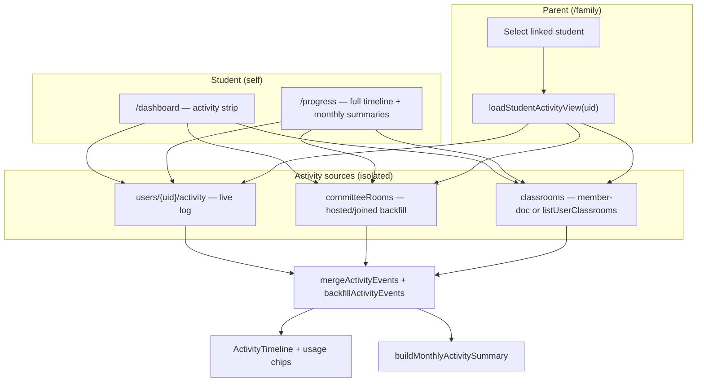

## Summary

This PR completes the **parent/student progress track**: students get a dedicated **My progress** page, the parent portal loads linked-child activity more reliably, and a small UI polish pass improves nav/dashboard chrome **without changing hero or auth stage photos**.

### Architecture — activity data flow

### Parent portal fix (root cause)

The previous `collectionGroup('members')` + bare `documentId()` query was unreliable under Firestore rules. This PR replaces it with **per-classroom** reads:

`classrooms/{id}/members/{studentUid}` — allowed via `linkedParentOf` in rules.

Each data source is wrapped in **try/catch** so one permission-denied query cannot wipe the entire timeline.

---

## Changes at a glance

| Area | What changed | Why |
| --- | --- | --- |
| **`/progress`** | New `ProgressPage` — full timeline, usage chips, monthly summary picker | Students see the same depth as parents, for their own account |
| **Nav + dashboard** | "My progress" nav link; dashboard link to full progress view | Discoverability from chrome and dashboard |
| **`activity.ts`** | Member-doc classroom backfill; isolated source failures; clearer load path | Fix parent "Missing or insufficient permissions" blank states |
| **`rooms.ts`** | Per-query try/catch in `fetchCommitteeRoomsForUser` | Rooms backfill survives partial denials |
| **`FamilyPage`** | Clear events on student switch; error banners; "Updated …" timestamp; better empty states | No stale data; actionable permission errors |
| **`SiteChrome`** | `@username` first in user chip | Matches how students identify each other |
| **`index.css`** | Nav underlines, header button pills, dashboard panel accents, activity strip cleanup | UI polish only — **hero/login/signup images unchanged** |
| **Docs** | README, OUTLINE, ROADMAP updated | Track marked done; Phase 3 AI deferred; integrity/themes notes |

---

## Files touched

| File | Role |
| --- | --- |
| `src/pages/ProgressPage.tsx` | New student self-progress page |
| `src/services/activity.ts` | Parent load hardening + member-doc classrooms |
| `src/services/rooms.ts` | Resilient room fetch for backfill |
| `src/pages/FamilyPage.tsx` | Parent portal UX + error handling |
| `src/pages/DashboardPage.tsx` | Link to `/progress` |
| `src/App.tsx` | Route registration |
| `src/components/layout/SiteChrome.tsx` | Nav + user chip |
| `src/index.css` | Chrome/dashboard polish (no photo changes) |
| `README.md`, `OUTLINE.md`, `ROADMAP.md` | Documentation |

---

## Deploy note

If parent activity still shows permission errors in production, **publish** `firebase/firestore.rules` in the Firebase Console (CLI deploy was not run from CI here). Students should also open **Dashboard** once so backfill can sync to Firestore.

---

## Test plan

- [ ] Sign in as a **student** → `/progress` shows timeline + monthly summary; nav link works
- [ ] Dashboard activity strip still works; link opens full progress page
- [ ] Sign in as a **parent** with a linked student → `/family` loads activity (not blank/stale on switch)
- [ ] Switch between linked students → previous student's events clear immediately
- [ ] Permission error (if rules not published) shows helpful banner, not stale data
- [ ] Hero landing, login, and signup stage **photos look unchanged** (no brightening)
- [ ] Nav underlines, sign-out button, dashboard panels look polished
- [ ] `npm run build` passes
