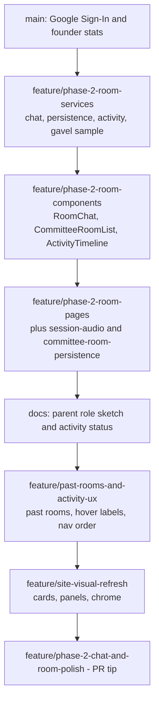

## Summary

This PR lands the stacked Phase 2 follow-ons on top of Google Sign-In / founder stats (`main`): live committee-room chat, room persistence (host + join), session audio / gavel sample, dashboard activity timeline, past-rooms UX, and a site-wide visual refresh.

| Area | What shipped | Key paths |
| --- | --- | --- |
| Room chat | Per-room `messages` subcollection, participant-only rules, live seat labels, 1000-char limit | `src/services/messages.ts`, `RoomChat.tsx`, `firestore.rules` |
| Persistence | Hosted + joined rooms stream; close room → past list; closed room page state | `src/services/rooms.ts`, `DashboardPage.tsx`, `RoomsPage.tsx` |
| Session / audio | Start/resume vs end session; warning + end chimes; wooden gavel WAV | `CommitteeRoomPage.tsx`, `src/lib/gavelAudio.ts`, `public/sounds/gavel-tap.wav` |
| Activity | `users/{uid}/activity` log + backfill; usage chips; hover shows room/classroom name | `src/services/activity.ts`, `ActivityTimeline.tsx` |
| Nav / docs | Signed-in Dashboard earlier in nav; parent-role sketch parked in docs | `SiteChrome.tsx`, `OUTLINE.md`, `ROADMAP.md` |
| Visual refresh | Card lists, glass panels, stronger tokens/header/buttons, contrast fixes | `src/index.css`, `CommitteeRoomList.tsx` |

## Branch stack

Tip branch for this PR: `feature/phase-2-chat-and-room-polish` (includes everything below).

## Timeline

| When (stack order) | Milestone |
| --- | --- |
| 1 | Services + rules + gavel sample (`7456a29`) |
| 2 | UI components for chat, room list, activity (`17fc62f`) |
| 3 | Wire into room/dashboard/rooms pages + session audio (`b8d19bf`) |
| 4 | Docs: parent sketch + activity timeline status (`185fbe0`) |
| 5 | Past rooms on dashboard/hub + activity label polish (`f243e43`) |
| 6 | Site-wide visual refresh (`c4280af`) |

## Deploy / ops notes

- **Publish** updated `firebase/firestore.rules` (messages participant-only, activity subcollection, close fields).
- Collection-group query on `participants` may need a Firebase composite index the first time it runs in console.
- Gavel audio: `public/sounds/gavel-tap.wav` must be deployed with Pages build.

## Test plan

- [ ] Sign in → create a committee room → open room → send chat as chair and as a second account / join link
- [ ] Late joiner sees full chat history; seat label updates after role change
- [ ] Chat over 1000 chars shows warning and disables Send
- [ ] Host closes room → disappears from Live, appears under Past with View
- [ ] Dashboard activity timeline shows date + action; room/classroom name only on hover
- [ ] Session start/recess + timer warning/end sounds; gavel tap plays clear sample after gesture unlock
- [ ] Visuals: dashboard room cards, classrooms, practice modes, auth/profile buttons readable on light panels
- [ ] Nav: signed-in order Home → Dashboard → Conferences → Practice → Rooms
