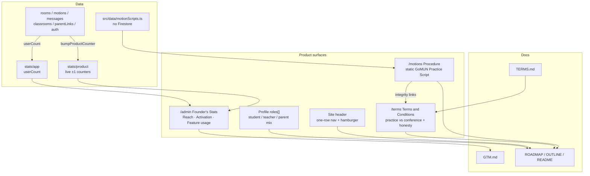

## Summary

This PR ships the next product slice after parent/student progress: **Founder Stats you can actually use for GTM**, a **Procedure (Scripts of Motions)** practice aid, public **Terms and Conditions**, and a **layout-only header fix** so the navy bar stays one row. Hero, login, and signup photos are unchanged — no color-scheme rewrite and no darker overlays.

It also includes the already-landed local commit that lets one account combine parent, student, and teacher roles.

| Slice | What changed | Why |
| --- | --- | --- |
| **Phase 2.7 Founder Stats** | `stats/product` counters + `/admin` Reach / Activation / Feature usage + founder backfill | GTM needs more than a raw user count |
| **GTM + Terms docs** | New `GTM.md` and `TERMS.md`; README / OUTLINE / ROADMAP updated | Product and outreach stay aligned |
| **Phase 5.1 Procedure** | `/motions` GoMUN Practice Script, nav **Procedure**, Practice + in-room links | Chairs/delegates can run floor language without treating it as official RoP |
| **Terms and Conditions** | Public `/terms`, footer link, integrity cross-links | Practice vs conference, academic honesty, AI boundary |
| **Header chrome** | Single-row desktop nav, shorter labels, compact `@handle` chip, hamburger under ~1024px | “Founder's Stats” no longer wraps onto a second row |
| **Multi-role profile** | Parent + student + teacher on one UID | Already committed on this branch; needed for Family + Dashboard together |

## How the pieces connect

## Test plan

- [ ] Signed-in student/teacher: **Procedure** in the header (one row) opens `/motions`; print works; parent-only does not see Procedure
- [ ] In-room **Procedure help** opens `/motions` in a new tab; Practice hub links there too
- [ ] `/terms` title is **Terms and Conditions**; footer + Procedure page link to it
- [ ] Founder (`dhyanvim@gmail.com`): `/admin` shows Reach / Activation / Feature usage; non-founder cannot use it
- [ ] After publishing `firebase/firestore.rules`, run **Backfill from existing data** once on `/admin`
- [ ] Create/join room, propose a motion, vote, send chat — counters increment (or log a bump failure without breaking the action)
- [ ] Desktop ~1280px: nav stays **one row**; long `@username` truncates; hover title shows full handle
- [ ] ≤1024px: hamburger opens drawer; backdrop / Escape close; Sign out available in the drawer
- [ ] Landing / login / signup **photos look the same** as before (no darker overlay)
- [ ] Multi-role: Profile can hold parent + student/teacher; Family + Dashboard both available

## Ops / legal notes

- Publish Firestore rules (`stats/product` + founder backfill reads) before trusting `/admin`.
- On-site Terms are a **product draft**, not counsel-reviewed legal advice.
- Procedure is a **practice aid**, not official conference RoP.
